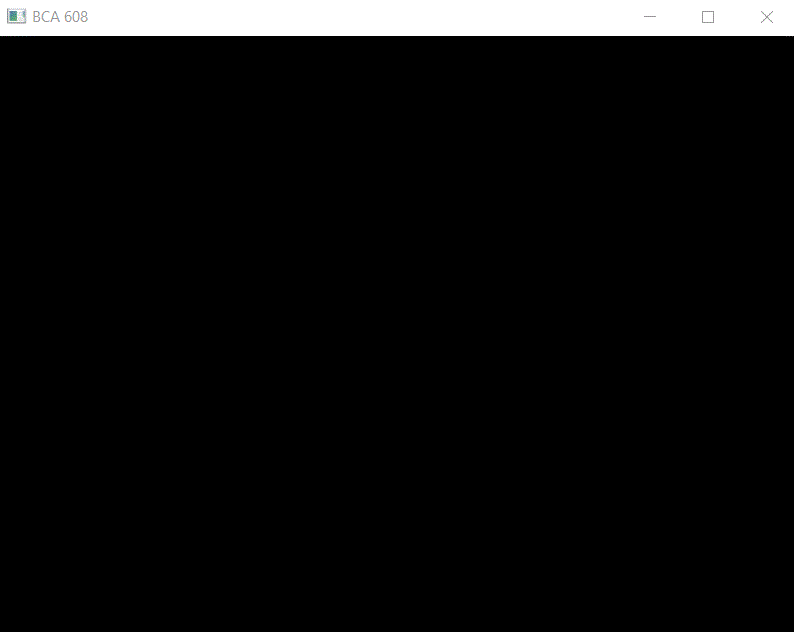

# opengl

opengl_lib_works

Convex hull animation (convex_hull_problem.cpp)

[Assignment Submission PDF](https://github.com/caginagirdemir/opengl/blob/master/pdf_files/report_convexhull.pdf)

Voronoi diagram (voronoi_diagram_solver.cpp)

[Assignment Submission PDF](https://github.com/caginagirdemir/opengl/blob/master/pdf_files/voronoi_diagram.pdf)

2d Ray Tracing (2d_ray_tracing.cpp)

 [Assignment Submission PDF](https://github.com/caginagirdemir/opengl/blob/master/pdf_files/rapor_2d_ray_tracing.pdf)

**dept_buffer_test.cpp** There are 3 rectange and you can control x, y and z axis from x,y,z keys

**draw_desktop_clock.cpp** curves used to 2 circle angles

**gram-schimdt.cpp** define 3 vectors in code, you can change vectors values on e variable. This calculator check on https://www.emathhelp.net/calculators/linear-algebra/gram-schmidt-calculator/ web site

**triangle_plane_example.cpp** edited from a example project. you can change shape mode GL_FILL and GL_LINE through 'w' key, and you can reverse shape through 'r' key and 'c' key

**name_shape.cpp** you can change shape mode GL_FILL and GL_LINE through 'w' key

**controlable_mechanical_arm.cpp** you have 3 turnable joints, have 6 keys for each joint for turn x,y,z axis, every key pairs make subtract and add 5 magnitude to axis. All joints bound to former joints. You can control first joint through z,x,c,v,b,n keys; for second joint a,s,d,f,g,h and last one q,w,e,r,t,y

